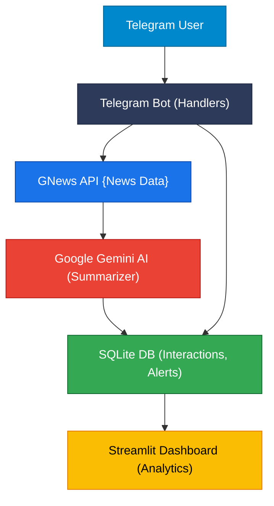

# **AI News Digest Telegram Bot**

>Get summarized, AI-analyzed news instantly — personalized, alert-driven, and tracked with analytics.

---

## **Overview**

The **AI News Digest Telegram Bot** delivers real-time, AI-summarized news fetched from the **GNews API** and analyzed by **Google Gemini AI**, all through a Telegram interface.

It enables:

* Personalized topic tracking
* Keyword-based news alerts
* Trending topic discovery
* Persistent memory (SQLite)
* Analytics visualization via **Streamlit Dashboard**

This project bridges **real-time news aggregation**, **AI summarization**, and **user personalization**, helping users stay informed efficiently.

---

## **System Overview**

```
User (Telegram)
   │
   ▼
Telegram Bot (python-telegram-bot)
   │
   ▼
Bot Commands Layer (/news, /alert, /history, etc.)
   │
   ▼
Business Logic Layer
   ├── GNews API (fetch raw news)
   ├── Gemini AI (summarize headlines)
   └── SQLite DB (persist memory)
   │
   ▼
Analytics Dashboard (Streamlit)
   └── Reads from SQLite → Displays trends, usage stats
```

---

## 🧠 System Architecture — AI News Telegram Bot



---

## **Features & Commands**

| Command               | Description                                                     |
| --------------------- | --------------------------------------------------------------- |
| `/news <topic>`       | Fetches and summarizes top 5 news for given topic/category      |
| `/history`            | Displays last few AI summaries viewed by user                   |
| `/mytopics`           | Shows user’s most frequently searched topics                    |
| `/discover`           | Recommends trending topics user hasn’t explored yet             |
| `/alert <keyword>`    | Subscribes user to alerts for keyword appearance in future news |
| `/alerts`             | Lists all active alerts for user                                |
| `/removealert <word>` | Deletes a specific alert keyword                                |
| `/trending`           | Displays globally trending topics (based on all user queries)   |

---

## **Streamlit Analytics Dashboard**

### **Purpose:**

The dashboard provides **visual insights** into bot usage patterns and trending topics.

### **Features:**

* Total users, topics, and alerts count
* Top requested topics (bar chart)
* User activity timeline (line chart)
* Active alerts overview table
* Recent summaries preview


### **Run Dashboard:**

```
streamlit run dash.py
```

---

## **Detailed Command Flows**

### **1. /news Flow**

```
User → /news AI
       ↓
Telegram Bot Handler
       ↓
Fetch articles from GNews API
       ↓
Summarize using Gemini AI
       ↓
Store (topic, summary) in SQLite
       ↓
Check alerts for matching keywords
       ↓
Notify relevant users
       ↓
Send summary digest to user (and channel)
```

### **2. /alert Flow**

```
User → /alert Bitcoin
       ↓
Save (chat_id, keyword) in SQLite alerts table
       ↓
Next /news execution checks all alerts
       ↓
If keyword found → Notify subscriber
```

### **3. /history Flow**

```
User → /history 5
       ↓
Fetch last 5 summaries for chat_id
       ↓
Display in chronological order
```

---

## **Database Design**

### **1. interactions**

| Field       | Type         | Description                 |
| ----------- | ------------ | --------------------------- |
| id          | INTEGER (PK) | Auto-increment primary key  |
| chat_id     | TEXT         | Telegram chat/user ID       |
| input_topic | TEXT         | Topic or category requested |
| news_data   | TEXT         | Raw fetched news            |
| summary     | TEXT         | Gemini AI summarized text   |
| timestamp   | DATETIME     | Auto-generated at insert    |

### **2. alerts**

| Field   | Type         | Description           |
| ------- | ------------ | --------------------- |
| id      | INTEGER (PK) | Auto-increment        |
| chat_id | TEXT         | Telegram chat/user ID |
| keyword | TEXT         | User alert keyword    |

---

## **Low-Level Design (LLD)**

| Component             | Description                                           |
| --------------------- | ----------------------------------------------------- |
| `get_news()`          | Fetches top 5 headlines from GNews API                |
| `summarize_with_ai()` | Sends text to Gemini API and returns concise summary  |
| `news_command()`      | Handles /news logic: fetch → summarize → notify → log |
| `log_interaction()`   | Saves user input and AI summary into SQLite DB        |
| `notify_alerts()`     | Cross-checks new headlines against alert keywords     |
| `alert_command()`     | Adds keyword alert entry to DB                        |
| `discover_command()`  | Suggests trending unexplored topics                   |
| `history_command()`   | Fetches recent summaries for user                     |
| `trending_command()`  | Finds globally popular topics                         |

---

## **Integration Details**

### **1. GNews API**

* Endpoint: `https://gnews.io/api/v4/`
* Parameters:

  * `category`, `lang`, `country`, `q`, `max`
* Response: JSON containing article titles and descriptions
* Requires: `GNEWS_API_KEY`

### **2. Google Gemini API**

* Model: `gemini-2.0-flash`
* Purpose: Summarize fetched news
* Requires: `GOOGLE_API_KEY`

---

## **Environment Variables**

| Variable             | Description                       |
| -------------------- | --------------------------------- |
| `TELEGRAM_BOT_TOKEN` | Bot token from @BotFather         |
| `GNEWS_API_KEY`      | API key from GNews                |
| `GOOGLE_API_KEY`     | API key for Google Gemini         |
| `TELEGRAM_CHAT_ID`   | Optional channel ID for broadcast |

---

## **Tech Stack**

| Layer         | Technology                               |
| ------------- | ---------------------------------------- |
| Bot Framework | `python-telegram-bot`                    |
| AI Summarizer | `google-generativeai` (Gemini 2.0 Flash) |
| Database      | SQLite3                                  |
| Analytics UI  | Streamlit                                |
| Visualization | Matplotlib, Pandas                       |
| Environment   | Python 3.10+, dotenv, requests           |

---

## **Example Output**

**Command:** `/news space`

```
AI News Digest: Space

• NASA prepares new lunar module test for 2025.
• SpaceX schedules next Starlink launch this week.
• ISRO announces collaboration on Mars data analysis.
• China’s Tiangong station expands research capacity.
• Private firms eye asteroid mining as next frontier.
```

---

## **Future Enhancements**

* Multi-language AI summaries
* Voice summaries
* Automated newsletter digest
* AI-based keyword suggestions
* Cloud-hosted analytics
---

## **Video demo link**
https://drive.google.com/file/d/1KmPwD4htbsY7_Ylt0xhizxqtPylGNvrg/view?usp=sharing


